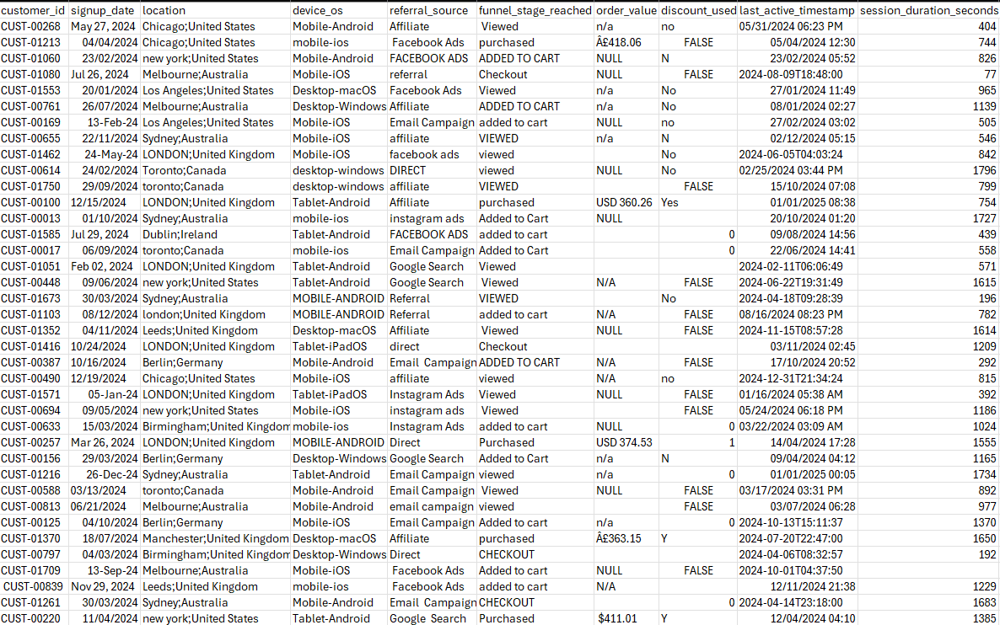
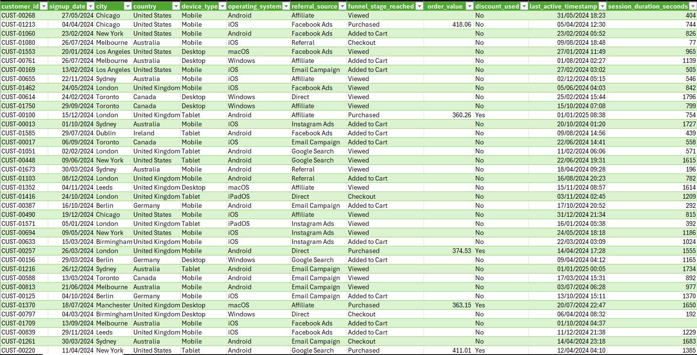

# E-Commerce Purchase Funnel Analysis
Customer funnel analysis using SQL (PostgreSQL), Excel, and PowerBI, aiming to identify where customers drop off between viewing a product and completing a purchase, in addition to uncovering actionable insights to improve conversion and recover lost revenue. 

Note: This is a simulated dataset generated to reflect realistic e-commerce funnel behaviour, and does not represent a real company's customer data. 

## Repository Structure
- `/SQL` - PostgreSQL queries used for funnel analysis and data exploration
- `/Excel` - Formula-based analysis and data cleaning 
- `/PowerBI` - Interactive dashboard for visualising funnel drop-off and conversion
- `/dataset` - Raw and cleaned datasets used for this project

## Data Cleaning
Before analysis, the raw dataset required significant cleaning in Excel using Power Query, including: 
- splitting combined fields (`location`, `device_os`) into separate columns
- standardising inconsistent text casings and whitespaces across all columns 
- standardising inconsistent formats and values across columns (e.g. mixed date formats, and inconsistent yes/no values such as "Y", "Yes", "1")
- handling invalid negative values 
- removing duplicate rows

### Before 

### After 

## SQL
### Business Findings
#### ...