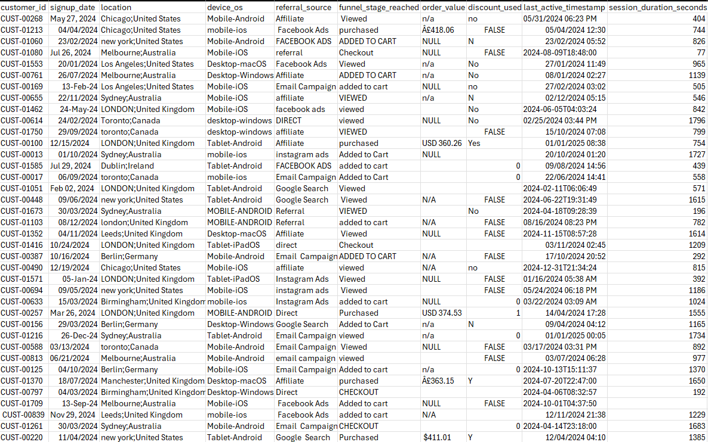
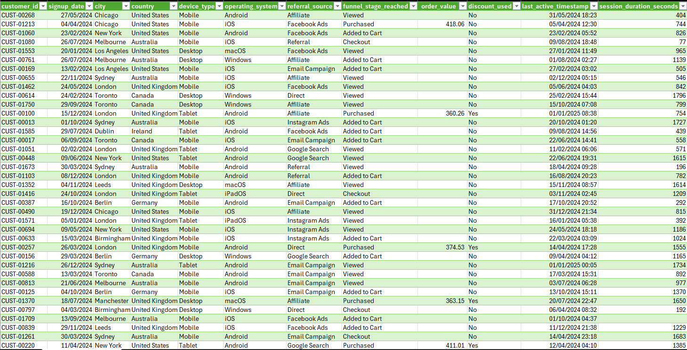
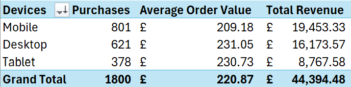
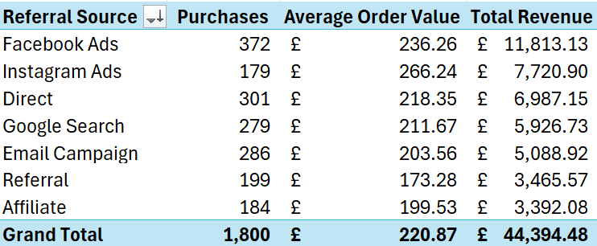
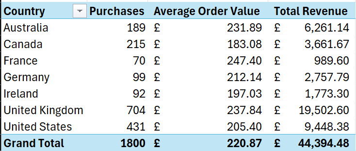
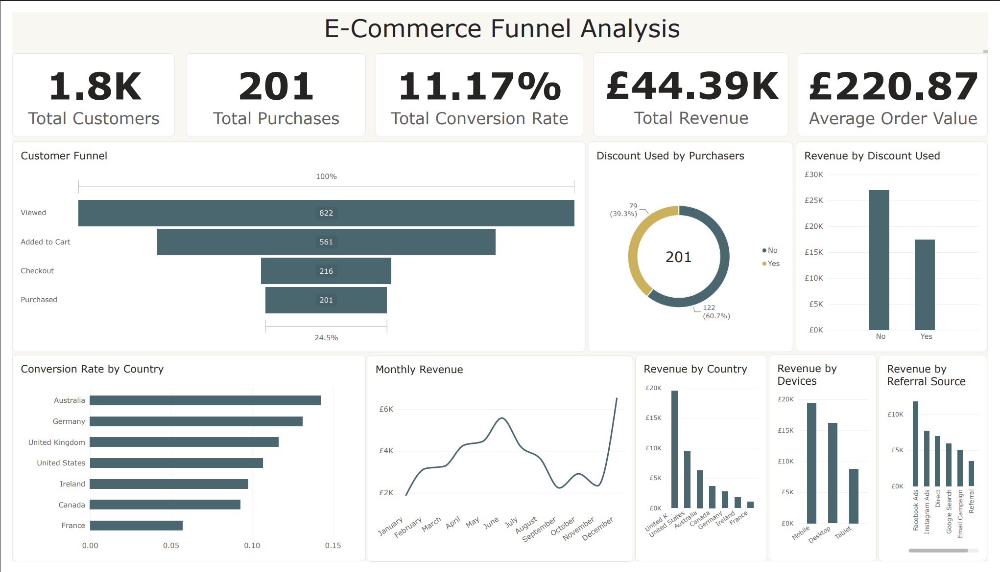

# E-Commerce Purchase Funnel Analysis
Customer funnel analysis using SQL (PostgreSQL), Excel, and PowerBI, aiming to identify where customers drop off between viewing a product and completing a purchase, in addition to uncovering actionable insights to improve conversion and recover lost revenue. 

Note: This is a simulated dataset generated to reflect realistic e-commerce funnel behaviour, and does not represent a real company's customer data. 

## Repository Structure
- `/SQL` - PostgreSQL queries used for funnel analysis and data exploration
- `/PowerBI` - Interactive dashboard for visualising funnel drop-off and conversion
- `/dataset` - Contains raw and cleaned datasets in excel used for this project

## Data Cleaning
Before analysis, the raw dataset required significant cleaning in Excel using Power Query, including: 
- splitting combined fields (`location`, `device_os`) into separate columns
- standardising inconsistent text casings and whitespaces across all columns 
- standardising inconsistent formats and values across columns (e.g. mixed date formats, and inconsistent yes/no values such as "Y", "Yes", "1")
- handling invalid negative values 
- removing duplicate rows

### Before 

### After 

## SQL
### Funnel Overview 
- Of the 1800 customers who entered the funnel, only 201 (11.17%) went on to complete a purchase
- The largest single group - 822 customers (45.67%) - never progress beyond viewing a product at all, making it the single biggest point of customer loss in the entire funnel
- A large "Viewed only" group is common, and could point to several underlying causes: 
    - Casual browsing with no real intent to buy 
    - Product pages that don't clearly communicate value, or quality 
    - Customers who saw the price and decided not to continue  

| Funnel Stage | Customers | Share of Total |
|---|---|---|
| Viewed | 822 | 45.67% |
| Added to Cart | 561 | 31.17% |
| Checkout | 216 | 12.00% |
| Purchased | 201 | 11.17% |

### Business Findings
#### Conversion Rate by Device Type
- Conversion rate is nearly identical across all device types (10.05%-11.61%), closely matching the overall funnel conversion rate of 11.17%
- 'Mobile' accounts for the highest number of purchases (93), ahead of 'Desktop' (70) and 'Tablet' (38)
    - However, this reflects 'Mobile' having the largest customer base overall, not a higher conversion rate

| Device Type | Total Purchased | Conversion Rate |
|---|---|---|
| Mobile | 93 | 11.61% |
| Desktop | 70 | 11.27% |
| Tablet | 38 | 10.05% |

#### Conversion Rate by Operating System
- Similar to Device Types, conversion rate is fairly consistent across operating systems (9.71%-12.05%), again closely matching the overall baseline of 11.17%
- Combined with the 'device_type' findings above, it can be concluded that neither device or operating system appear to be a meaningful driver of funnel conversion in this dataset

| Operating System | Total Purchased | Conversion Rate |
|---|---|---|
| Windows | 50 | 12.05% |
| Android | 64 | 11.55% |
| iOS | 46 | 10.75% |
| iPadOS | 21 | 10.66% |
| macOS | 20 | 9.71% |

#### Conversion Rate by Referral Source
- Referral Source shows the clearest variation in conversion found so far in the analysis
    - The conversion rate used in this analysis shows the share of customers from each referral source who went all the way through the funnel to make a purchase, out of everyone that source brought in
- 'Instagram Ads' (16.20%) convert at nearly double the rate of 'Email Campaign' (8.74%)
- 'Facebook Ads' generate the highest purchase volume (50) despite a lower rate than 'Instagram Ads'
- 'Instagram Ads' and 'Facebook Ads' (both paid advertising on socal media platforms) may attract more purchase-ready customers through targeted product ads, while 'Email Campaigns' and 'Affiliate' links may draw a broader audience less ready to buy

| Referral Source | Total Purchased | Conversion Rate |
|---|---|---|
| Instagram Ads | 29 | 16.02% |
| Facebook Ads | 50 | 13.44% |
| Direct | 32 | 10.63% |
| Referral | 20 | 10.05% |
| Google Search | 28 | 10.04% |
| Affiliate | 17 | 9.24% |
| Email Campaign | 25 | 8.74% |

#### Conversion Rate by Country
- Conversion rate ranges from 14.29% in 'Australia', to 5.71% in 'France'
- The 'United Kingdom' drives by far the highest purchase volume (82), due to its much larger customer base (704), even though its conversion rate sits closely in the middle of the range

| Country | Total Purchased | Total Customers | Conversion Rate |
|---|---|---|---|
| Australia | 27 | 189 | 14.29% |
| Germany | 13 | 99 | 13.13% |
| United Kingdom | 82 | 704 | 11.65% |
| United States | 46 | 431 | 10.67% |
| Ireland | 9 | 92 | 9.78% |
| Canada | 20 | 215 | 9.30% |
| France | 4 | 70 | 5.71% |

#### Conversion Rate by City
- 'Leeds' and 'Melbourne' convert best (15.15% and 14.85%), while 'Paris' remains the weakest peformer even at the city level, matching its country-level conversion rate exactly
- Notably, London and Manchester - the UK's two highest-volume cities in the dataset (299 and 202) - convert at only 11.39%-11.71%, well below Leeds' 15.15%, in spite of the UK's strong overall country-level conversion rate (11.65%)
- This suggests that the UK's conversion figure (11.65%) is closer to their weaker performance than to Leeds' stronger one, due to the fact that the bigger cities have more customers, leading to the average leaning toward the bigger cities' conversion rate

| City | Total Purchased | Total Customers | Conversion Rate |
|---|---|---|---|
| Leeds | 15 | 99 | 15.15% |
| Melbourne | 15 | 101 | 14.85% |
| Sydney | 12 | 88 | 13.64% |
| Berlin | 13 | 99 | 13.13% |
| Los Angeles | 15 | 115 | 13.04% |
| Chicago | 14 | 117 | 11.97% |
| London | 35 | 299 | 11.71% |
| Manchester | 23 | 202 | 11.39% |
| Dublin | 9 | 92 | 9.78% |
| Toronto | 20 | 215 | 9.30% |
| Birmingham | 9 | 104 | 8.65% |
| New York | 17 | 199 | 8.54% |
| Paris | 4 | 70 | 5.71% |

#### Conversion Rate by Session Duration
- The 1500-1799 (25-30 minute) group has the highest conversion rate among all the non-blank brackets, at a conversion rate of 13.46%, followed by the 900-1199 (15-20 minute) group at 12.94%
- Shorter sessions convert at lower rates, with the 17-299 second group converting at 9.34%, and the 300-599 and 600-899 groups converting at 9.64% and 9.03%
- The 1200-1499 (20-25 minute) group sits between these ranges, with a conversion rate of 10.07%
    - This suggests that customers who spend approximately 15-30 minutes in a session are associated with stronger purchase rates than customers with shorter sessions
- Shorter session durations are most likely due to low product-page engagement, suggesting improvements to product information, visuals, etc. could help encourage customers to progress further through the funnel
- Note: The 'Blank' category represents customers whose 'session_duration_seconds' values were set to null during data cleaning, due to invalid negative numbers

| Session Duration | Total Viewed | Total Added to Cart | Total Checkout | Total Purchased | Conversion Rate |
|---|---|---|---|---|---|
| 17–299 seconds | 122 | 86 | 25 | 24 | 9.34% |
| 300–599 seconds | 143 | 79 | 31 | 27 | 9.64% |
| 600–899 seconds | 131 | 91 | 40 | 26 | 9.03% |
| 900–1199 seconds | 138 | 71 | 40 | 37 | 12.94% |
| 1200–1499 seconds | 117 | 103 | 30 | 28 | 10.07% |
| 1500–1799 seconds | 136 | 95 | 39 | 42 | 13.46% |
| Blank | 35 | 36 | 11 | 17 | 17.17% |

## Excel
### Revenue by Device Type

- 'Mobile' has the largest customer base (801) and generates the highest total revenue at £19,453.33
- 'Desktop' customers have a higher average order value (£231.05) than mobile customers (£209.18), despite generating less total revenue
- 'Tablet' has a similar average order value to desktop (£230.73) but generates the lowest total revenue due to its smaller customer base (378)
- 'Mobile' generates the most total revenue primarily because it has the largest customer base, with 801 customers compared with 621 on 'Desktop' and 378 on 'Tablet'. Although 'Mobile' has the lowest average order value (£209.18), its much larger customer volume results in the highest overall revenue, indicating that revenue is being driven more by the number of customers, than by higher-value individual orders

### Revenue by Referral Source

- 'Facebook Ads' generate the highest total revenue (£11,813.13) becasue they have the largest customer base (372), while 'Instagram Ads' have the highest average order value (£266.24) but generate less total revenue, due to having fewer customers. Similarly to Device Types, customer volume appears to be the main driver of total revenue across Referral Sources.

### Revenue by Country

- The 'United Kingdom' generates the highest total revenue (£19,502.60) because it has the largest customer base (704) combined with a relatively high average order value (£237.84), while 'France' has the highest average order value (£247.40) but generates only £989.60 due to its much smaller customer base
- This indicates once again that customer base is a key driver of total revenue, with higher average order values having less impact when the number of customers is relatively small

## Power BI
### Dashboard

### Key Dashboard Findings 
- The overall purchase conversion rate (the proportion of customers who completed a purchase out of all customers) is 11.17%, with 201 purchases from 1,800 customers. 
- 'Mobile', 'Facebook Ads', and the 'United Kingdom' generate the highest total revenue within their respective categories, primarily due to their large customer bases.
- Revenue flucuates throughout the year, with several noticeable increases and decreases, with the largest increase occuring in December, creating a clear year-end peak in revenue.
- Possible causes for these fluctuations include seasonal shopping, promotional campaigns, increased advertising activity during these periods, etc. The December spike could potentially be associated to higher purchasing activity around the holiday period. 

### Some Improvements based on Analysis
- 45.67% of customers (822) leave after only viewing a product, making it the largest point of customer loss. Improving product descriptions, images, pricing, etc. could encourage more customers to progress from 'Viewed' to the next stage in the funnel.
- Improvements to deepen customer engagement could be beneficial, as customers with sessions of 15-30 minutes have stronger conversion rates (12.94%-13.46%) than customers with sessions under 15 minutes. Enhancing product-page content, targeted recommendations, and site navigation could encourage customers to engage with the products for longer and progress further down the funnel.
- 'Instagram Ads' have the highest conversion rate at 16.02%. Prioritising higher-converting referral sources, such as Instagram and Facebook ads, while reviewing better applications for lower-converting sources, could help improve overall conversion. 
    - Possible applications of lower-converting referral sources, such as 'Email Campaigns', could be that rather than emailing all customers, targeted emails are sent to customers who have previously shown interest in related products, using persionalised product recommendations to increase relevance and likely improve conversion. 
- Due to the limitations of the dataset, further investigation into the December revenue peak could help identify what contributed to the increase and whether similar activity could be replicated. 